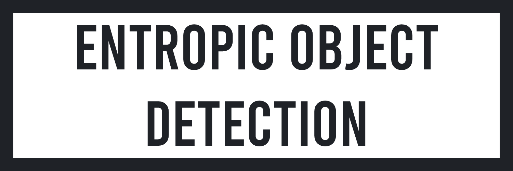

# About The Project
The aim of this project is to show the work done on entropic object detection applied to the game of Petanque. In Petanque, the objective is to score points by placing your balls closer to the cochonnet than your opponent. Once all the balls have been thrown, the team with the balls closest to the cochonnet wins points. Points are awarded according to the number of balls close to the cochonnet

# Preview

In some rounds, the different balls are almost equidistant from the cochonnet. It is therefore impossible to choose with the eye to which team to distribute the points. So I was interested in how to implement an entropic object detection algorithm (here the balls and the cochonnet) which would allow to show instantly the closest ball to the cochonnet.

# Approach

We use two images to perform ball detection: one with the balls and one without. The goal will be to calculate the statistical difference between the two images which will make it possible to determine the location of the balls. Pooling consists of going through the matrix of an image with a kernel (here 3x3) and associating to each pixel a variance and an average from the values of the kernel. By repeating this process on the two images, we obtain two pairs for each pixel, each containing a variance and a mean. It is these two pairs that we will use to calculate the Kullback-Leibler Divergence. Assuming that the distribution of the kernel values follows a Gaussian distribution, we could have the classic definition of the Kullback-Leibler Divergence. However, keeping the mean in the equation will create a bias because whether there is a ball or not the mean can be the same. Thus, we will calculate the divergence between the variance- mean pairs of each image. As the calculated values are very close, it is difficult to discern variations in the divergence. We will therefore calculate the log of the divergence: this will allow us to stretch the values and thus accentuate the variations.

# Limitations
The environment during data acquisition can very easily disturb the results obtained. Indeed, depending on the inclination of the sun, the shadow of the balls projected on the ground will erroneously detect the object: not only the balls but also their shadows will be detected, thus modifying the calculation of distances

---

By Axel Hippolite. All Rights Reserved.
